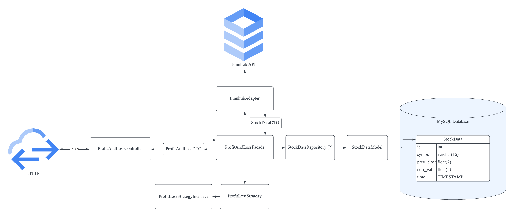

# Delio Tech Test
This Laravel app was developed by Michael McGettrick for Delio as part of their recruitment process.

Please note that the task is deliberately over-engineered. It features a number of unit tests and design patterns as well as a design approach that allows it to be expanded to handled different symbols or quantities, and even different methodologies of calculating profit and loss via the use of the strategy pattern. For example Time Weighted or even a percentage based strategy could be written to comply with the strategy interface and used in place of the Gross strategy without modification to the rest of the code base being necessary. 

As requested, this approach to the task uses Laravel framework. 

### Additional Documentation
Additional documentation is available in the "misc" folder in the root of this repo, including:
* Initial design of the system
* Copy of the original brief (also available at https://github.com/deliowales/php-technical-test)
* Specific Finnhub endpoint documentation: https://finnhub.io/docs/api/quote

Note that there is also an Open API .yaml file available in the root of the project repository.

### Initial Approach
This was the initial target system design:

### Setup Instructions
* Register for an API Token at https://finnhub.io/register
* Add your database connection details to the .env file in the root of this project
* Add your API Token to the .env file in the root of this project
* Run `php artisan migrate` to set up the database
* Navigate to `{YOUR_HOSTNAME}/api/profitandloss` to see your first calculation

### Dependencies
- PHP 8.1.16
- MySQL 5.7.26

### Further Considerations:
Though no explicit time constraint was placed on the delivery of this task, there are a number of considerations identified throughout development that would make candidates for future improvement:
- Use Docker
- Is the .env file the best place for API token?
- Use Finnhub PHP library? // Ran into problems with Laravel Guzzle version conflicts
- Are the DTOs a bit too loose?
- Tempted to return a 201 response on success because persistent records were created // Decided not to as this may be intentional
- Is there some caching that might be appropriate? For example, not checking the API endpoint over the weekend given the markets aren't open.
- Remove users table and Laravel bootstrapping.
- Deep philosophical discussion to be had about the role of eloquent models in the Domain Layer of applications. Should these models be allowed past the repository at all or that over-zealous?
- How to mock ORM given that they use static access?
- The Logger was also static - seems to be a lot of statics in Laravel's ecosystem. Some research to be done about statics/unit testing in Laravel
- Missing type hinting in Eloquent classes in PHPStorm // Development environment setup to play ball with Eloquent "magic" and laravel in general
- Allow users to specify their own stock symbols and quantities as GET parameters for API route. 
- Abstract Class for Repositories? //Would be really cool to show off but probably too much
- Implement a strategy for percentage profit/loss calculations // Well beyond the scope of the current task but would be great given the strategy pattern allows it
- Specific exceptions rather than generic exceptions to be thrown in the various places in the codebase
- Separate class to handle input validation responsibilities outside of the facade class

